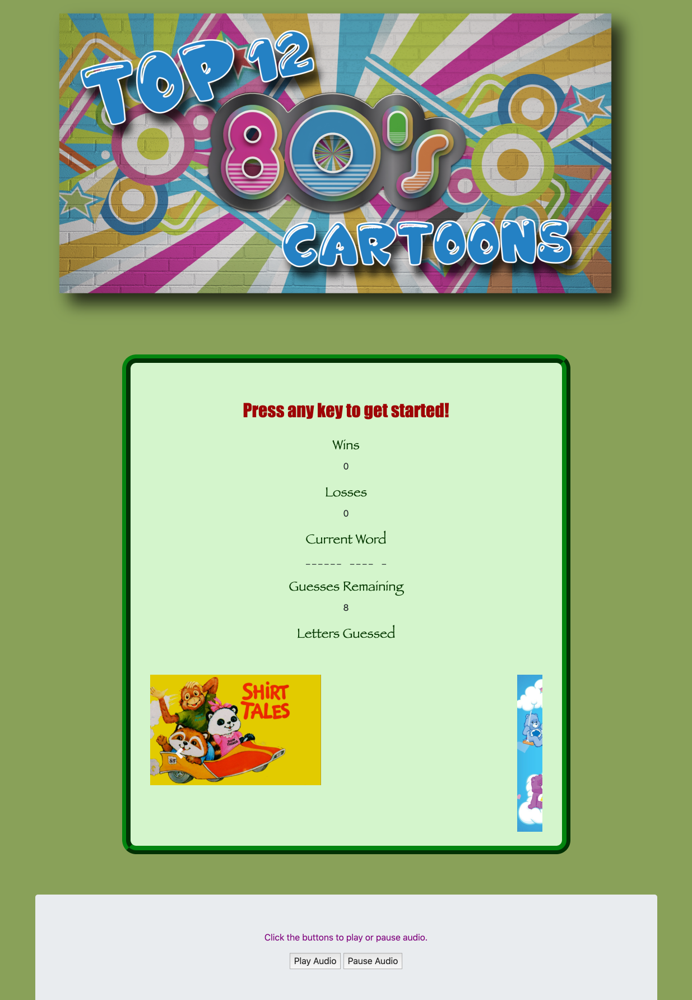

# Javascript Assignment

## Option Two: Word Guess Game (Challenge - Recommended)

# THEME: Top Twelve 80s Cartoons

### Instructions
- Used key events to listen for the letters that the player will type.
- Press any key to get started!
- Wins: (# of times player guessed the word correctly).
- If the word is Duck Tales, display it like this when the game starts: _ _ _ _  _ _ _ _ _.
- As the player guesses the correct letters, revealed as: d u c k  _ a _ e s.
- Number of Guesses Remaining: (# of guesses remaining for the player).
- Letters Already Guessed: (Letters the player has guessed, displayed like L Z Y H).
- After the player wins/loses the game automatically chooses another word and makes the player play it.

Word Guess Game Bonuses

- Sound plays when player guesses their word correct or incorrect.
- Optional music to play or pause at the bottom of the page.

HTML used to set up page
CSS used to design page
JavaScript

